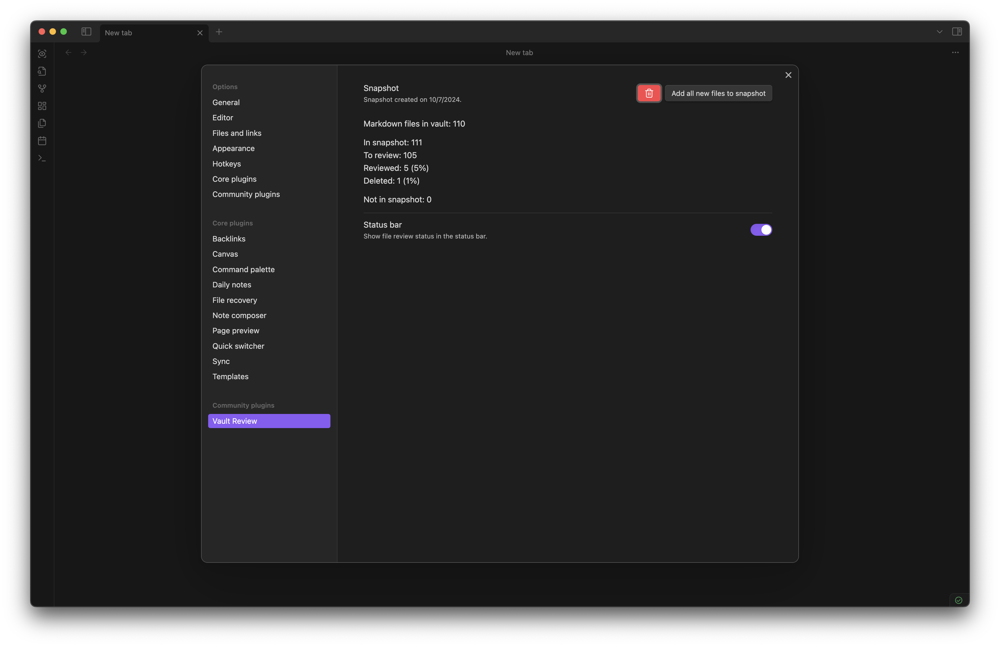

# Obsidian Vault Review

This plugin allows you to create a snapshot of your vault and randomly review files from it 1-by-1.

Features:

- To create a snapshot, open plugin settings.
- To update file review status use commands, ribbon or status bar (desktop).
- In settings you will find statistics about your review progress.
